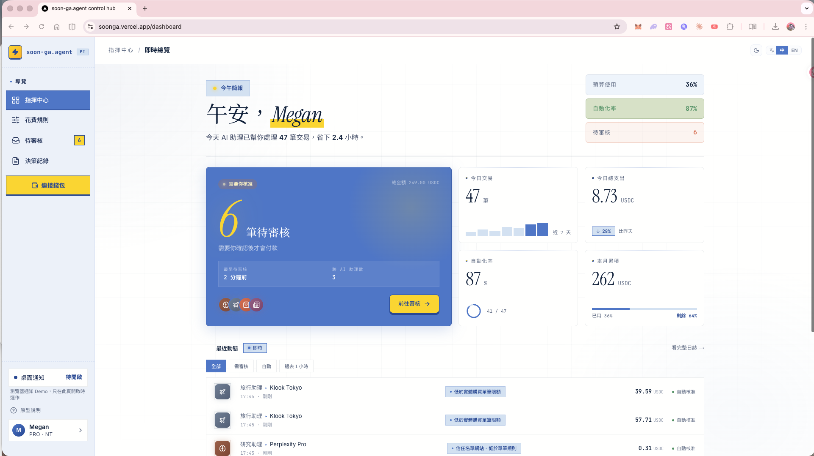

# soon-ga.agent control hub

**讓你的 AI 擁有錢包，你擁有遙控器。**
**Give your AI a wallet. Keep the remote in your hand.**

AI agent 支付控制層的互動產品原型．2026 Q2 portfolio 作品．
Interactive product prototype for an AI agent payment control layer．Portfolio piece, Q2 2026.

**🔗 Live demo → [soonga.vercel.app](https://soonga.vercel.app)**
**📄 Case study → [docs/case-study.md](docs/case-study.md)**

> 🔸 **這是互動式產品原型**．核心商業邏輯都是 mock，不會真的付錢、不會上鏈．
> 🔸 **This is an interactive prototype**．Core business logic is mocked．No real payments, no on-chain transactions.



---

## 🇹🇼 中文

### 在解什麼問題

2026 Q2，48 萬個 AI agent 已經透過 Coinbase Agentic.Market 的 x402 協議自己發起交易，累計 1.65 億美元。但**主人端的管理工具還沒跟上**——市面上的錢包只能設總額度、顯示冷冰冰的「請求支付 X 塊」，沒有類別預算、沒有時段限制、更沒有決策審計。soon-ga.agent control hub 填這個缺口。

### 四個核心模組

- **Command Center**（`/dashboard`）：一眼看完「我現在要不要決定什麼」。沒事就安靜，有事就亮琥珀色。
- **Rule Engine**（`/rules`）：類別額度、單筆上限、信任名單三層管 AI 助理。超出邊界就會自動進入待審核等你確認。
- **Contextual Approval**（`/approvals`）：把 AI 助理的推理翻成白話．「需要花這筆費用的理由」+「相關脈絡」+「觸發哪條規則」．支援「請 AI 找替代方案」的完整迴圈（按下去 10 秒後新方案會送回來）。
- **Decision Audit**（`/audit`）：每一筆決策的鏈上回執、reasoning、你的覆核都可追溯．對應 EU AI Act Art. 14 的 human oversight 與 auditability 要求．可匯出 CSV。

### 視覺語言

淺暖底 + 結構性卡片的支付控制台調性．配色語意刻意分清楚：

- **黃** = CTA / 品牌記號 / Hero 大數字（要你看的）
- **琥珀** = 待審核 / 警告（需要你決定的）
- **Sage 綠** = 自動核准 / 安全（已經處理掉的）
- **IKEA 藍** = 系統訊號 / 互動 affordance（可以操作的）

### 原型範圍：什麼是 mock，什麼是真的

| 是 mock（為了講清楚產品規格） | 是真的（瀏覽器原生能力） |
|---|---|
| 待審核佇列 / 規則執行 | 瀏覽器桌面通知（Web Notification API） |
| Audit log / 鏈上回執 | localStorage 顯示名稱個人化 |
| AI 助理推理 / counter-offer | zh / en 切換 |
| 錢包餘額 / x402 交易 | CSV 匯出 |
| 後端持久化 / 多裝置同步 | 規則設定在單一瀏覽器工作階段跨路由保留 |
| AI 規則解析（mock heuristics，非真實 LLM） | |

### 為什麼用 mock data 而不接真 API

這是**產品原型**不是 MVP。mock data 的目的是在不被 infra 拖住的情況下，專注把產品規格、UX 決策、資訊密度、互動邏輯一次講清楚。Phase 2 才是接 x402 測試網 + 真實 wallet．

### 下一階段（Phase 2）

這個原型完成的是面向使用者的探索層。Phase 2 把設計變成真產品，整合下面的 Web3 stack。每一項都選有理由，不是 buzzword 蒐集。

**wagmi + RainbowKit**
消費者錢包連線需要熟悉的 UX 模板。RainbowKit 提供業界標準的連接體驗，wagmi 處理底層 React hooks。

**ERC-4337 Account Abstraction**
spending limit 在 wallet layer 強制比 application layer 可信。Session keys 讓規則引擎的限額在鏈上強制執行，不只靠前端 UI。

**x402**
HTTP-native 的 agent payment 是這層的標準。當 AI agent 遇到付費 API 時用 x402 自動支付，不需要人類介入或預先充值帳號。

**On-chain audit trail**
支付控制台的核心承諾就是可追溯。鏈上紀錄是無法竄改的存證，比資料庫紀錄更符合 audit 的本質。

**注意：以上整合在 Phase 2 完成之前不會 demo。這段是設計探索的後續路徑，不是已實現的功能。**

### 技術選擇

Next.js 16 (App Router) · TypeScript · Tailwind CSS 4 · Base UI + shadcn · recharts · sonner · lucide-react

---

## 🇺🇸 English

### The problem

By Q2 2026, 480,000+ AI agents have initiated $165M in transactions through Coinbase Agentic.Market via the x402 protocol. But the **owner-side tooling has not caught up**—existing wallets only offer a single total budget and cold "Request to pay X USDC" prompts. No category budgets, no contextual reasoning, no audit trail. soon-ga.agent control hub fills that gap.

### Four core modules

- **Command Center** (`/dashboard`): At-a-glance answer to "do I need to decide anything right now?" Calm when nothing needs you; amber alert when something does.
- **Rule Engine** (`/rules`): Three layers govern your AI agent—category budgets, per-transaction caps, and merchant trust lists. Anything out of bounds joins the approval queue.
- **Contextual Approval** (`/approvals`): Translates agent reasoning into plain language—why this purchase is needed, given this task and context, and which rule it tripped. Full counter-offer loop: ask the agent for an alternative and a new proposal lands in ~10 seconds.
- **Decision Audit** (`/audit`): Every decision's on-chain receipt, agent reasoning, and your verdict—aligned with EU AI Act Article 14 requirements for human oversight and auditability. CSV export included.

### Visual language

A warm-light surface with structural cards—a payment control hub feel rather than a dark HUD. Colors carry strict semantic roles:

- **Yellow** = CTA, brand marks, hero numerals (look here)
- **Amber** = pending / warning (needs your call)
- **Sage** = auto-approved / safe (already handled)
- **IKEA blue** = system signal, interactive affordance (act here)

### Prototype scope — what's mock vs real

| Mocked (so the product spec stays the focus) | Actually working (native browser capabilities) |
|---|---|
| Pending queue / rule enforcement | Browser desktop notifications (Web Notification API) |
| Audit log / on-chain receipts | localStorage display-name personalization |
| Agent reasoning / counter-offers | zh / en locale switching |
| Wallet balance / x402 transactions | CSV export |
| Backend persistence / multi-device sync | Rule edits persist across routes in the same browser session |
| AI rule parsing (mock heuristics, not a real LLM) | |

### Why mock data instead of real APIs

This is a **product prototype**, not an MVP. Mock data lets the prototype focus on product spec, UX decisions, information density, and interaction logic—without getting dragged into infrastructure. Phase 2 will integrate x402 testnet and real wallets.

### Phase 2

This prototype is the user-facing exploration layer. Phase 2 turns the design into a real product by integrating the Web3 stack below. Each item is chosen for a specific reason, not buzzword bingo.

**wagmi + RainbowKit**
Consumer wallet connection needs familiar UX patterns. RainbowKit provides the industry-standard connection flow, wagmi handles React hooks underneath.

**ERC-4337 Account Abstraction**
Spending limits enforced at the wallet layer are more trustworthy than at the application layer. Session keys let the rule engine enforce caps on-chain, not just in UI.

**x402**
HTTP-native agent payments are emerging as the standard for this layer. When an AI agent hits a paywalled API, x402 lets it auto-pay without human intervention or pre-funded accounts.

**On-chain audit trail**
The core promise of any payment control hub is traceability. On-chain records are tamper-proof, more aligned with the nature of audit than database logs.

**Note: None of the above is demo-able until Phase 2 ships. Listed as forward roadmap, not current capability.**

### Stack

Next.js 16 (App Router) · TypeScript · Tailwind CSS 4 · Base UI + shadcn · recharts · sonner · lucide-react

---

## Getting started

```bash
npm install
npm run dev
```

Open [http://localhost:3000](http://localhost:3000)．

第一次打開會看到 **Welcome Modal**，可以輸入希望 AI 助理怎麼稱呼你（保存在瀏覽器本機，不會上傳）．Dashboard hero 的問候會用這個名字．Sidebar 底部「原型說明」可以重新打開這個 modal．
The first visit shows a **Welcome Modal** where you can set a display name (stored locally in your browser, never uploaded). The Dashboard greeting uses it. The "Prototype guide" entry at the bottom of the sidebar reopens the modal.

訪問 [http://localhost:3000?demo=1](http://localhost:3000?demo=1) 或在 dev mode 下會看到右下角浮出 **Demo Controls** 面板：切換深淺模式、處理一筆待審核、切換空態 / 待審核態、重置 demo．
Visit `?demo=1` (or run in dev mode) to surface a floating **Demo Controls** panel: toggle theme, resolve a pending item, swap empty / pending state, reset demo.

zh / en 切換在右上角 TopBar．The locale switcher lives in the top-right TopBar.

## Deployment

可部署至 Vercel．`npm run build` 為四個路由產出靜態頁面，沒有 backend、沒有 Node 20+ 之外的 runtime 依賴．
Deployable to Vercel. `npm run build` produces static pages for all four routes—no backend, no runtime dependencies beyond Node 20+.

---

*Built by Megan · 2026 · All personas and transactions are fictional.*
